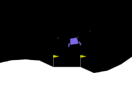

O problema do Lunar Lander do _OpenAI_ consiste em aterrissar uma nave espacial na superfície de um planeta, no local delimitado por duas bandeiras, como se pode ver na Figura:

O combustível da na nave é teoricamente infinito, podendo ser executadas quatro ações: ligar propulsor esquerdo, ligar o propulsor direito, ligar o propulsor principal ou não fazer nada.
As observações utilizadas no aprendizado por reforço profundo para cada tempo foram 8: as posições x e y, a velocidades em x e y, o ângulo da nave, a velocidade angular e as informações de se cada pé da nave toca a superfície planetária. Isto pode ser visto na Tabela:

Observation  | Type  |  Min  | Max
:-----------:|:-----:|:-----:|:-----:
x position   | float | -1.5  | 1.5
y position   | float | -1.5  | 1.5
x velocity   | float | -5.0  | 5.0
y velocity   | float | -5.0  | 5.0
Angle        | float | -3.14 | 3.14
Ang velocity | float | -5.0  | 5.0
Left Leg     | bool  | False | True
Right Leg    | bool  | False | True

No problema, poderiam ter sidos adicionados espaço contínuo, vento e turbulência, mas por simplicidade, decidimos considerar apenas a gravidade no pouso, sem efeitos mais complexos. 

No aprendizado por reforço, o próprio ambiente do _OpenAI_ já possuía uma recompensa, chamada em inglês de _reward_, embutida, que penalizava comportamento indesejados como: sair da região de pouso, colidir, utilizar o propulsor(teoricamente deseja-se que o mínimo de combustível seja gasto). Além disso, parabenizava bons comportamentos como: descer e parar, atingir o objetivo. Com a _reward_ proposta pela documentação do _OpenAI Gym_, porém, o treinamento da rede neural é lento.
